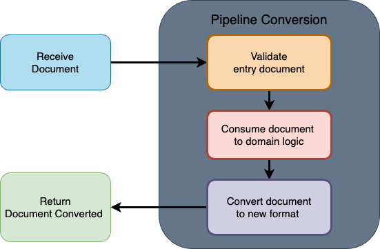

# challenge-document-converter-service

- [challenge-document-converter-service](#challenge-document-converter-service)
  - [Intro](#intro)
  - [Challenge](#challenge)
  - [API Running Screen Shot](#api-running-screen-shot)
  - [API design and logic](#api-design-and-logic)
    - [Entry document structure](#entry-document-structure)
  - [API Business logic Definitions](#api-business-logic-definitions)
      - [Entities](#entities)
      - [Providers](#providers)
  - [API Stack - Technologies used](#api-stack---technologies-used)
  - [FUTURE WORK](#future-work)

## Intro

This API which converts documents in 3 formats between them:

- XML to JSON, **_or vice-versa_**
- JSON to STRING, **_or vice-versa_**
- STRING to XML, **_or vice-versa_**

This project was build to reach the following challenge: `Write an API to convert documents between three different formats`

## Challenge

Write an API to convert documents between three different formats:

</details>

<details>
<summary>Format #1: String</summary>
<br>

String data is composed of ‘segments’ (i.e. lines), each of which is composed of multiple ‘elements’ (i.e. data values).
Segments/lines are delineated by a line separator character, and elements within a segment are delineated by element separator
characters. In the example below, the separator characters are ~ and \*.

Example:

```
ProductID*4*8*15*16*23~
2 ProductID*a*b*c*d*e~
3 AddressID*42*108*3*14~
4 ContactID*59*26~
```

The example above is composed of 4 segments. Each segment is composed of a segment name followed by a number of elements. The
first two segments have five elements, the third has four, and the fourth has two.

</details>

<details>
<summary>Format #2: JSON</summary>
<br>

Constraints:
Segments (lines) are nested in arrays and objects where the keys are the segment names followed by an incrementing integer from 1...n of elements.

Example:

```json
{
  "ProductID": [
    {
      "ProductID1": "4",
      "ProductID2": "8",
      "ProductID3": "15",
      "ProductID4": "16",
      "ProductID5": "23"
    },
    {
      "ProductID1": "a",
      "ProductID2": "b",
      "ProductID3": "c",
      "ProductID4": "d",
      "ProductID5": "e"
    }
  ],
  "AddressID": [
    {
      "AddressID1": "42",
      "AddressID2": "108",
      "AddressID3": "3",
      "AddressID4": "14"
    }
  ],
  "ContactID": [
    {
      "ContactID1": "59",
      "ContactID2": "26"
    }
  ]
}
```

</details>

<details>
<summary>Format #3: XML</summary>
<br>

Example:

```xml
  <root>
      <ProductID>
          <ProductID1>4</ProductID1>
          <ProductID2>8</ProductID2>
          <ProductID3>15</ProductID3>
          <ProductID4>16</ProductID4>
          <ProductID5>23</ProductID5>
      </ProductID>
      <ProductID>
          <ProductID1>a</ProductID1>
          <ProductID2>b</ProductID2>
          <ProductID3>c</ProductID3>
          <ProductID4>d</ProductID4>
          <ProductID5>e</ProductID5>
      </ProductID>
      <AddressID>
          <AddressID1>42</AddressID1>
          <AddressID2>108</AddressID2>
          <AddressID3>3</AddressID3>
          <AddressID4>14</AddressID4>
      </AddressID>
      <ContactID>
          <ContactID1>59</ContactID1>
          <ContactID2>26</ContactID2>
      </ContactID>
    </root>
```

</details>

## API Running Screen Shot

<details>
<summary>📸 1. Convert JSON document to XML</summary>
</details>

<details>
<summary>📸 2. Convert JSON document to STRING</summary>
</details>

<details>
<summary>📸 3. Convert XML document to JSON</summary>
</details>

<details>
<summary>📸 4. Convert XML document to STRING</summary>
</details>

<details>
<summary>📸 5. Convert STRING document to JSON</summary>
</details>

<details>
<summary>📸 6. Convert STRING document to XML</summary>
</details>

</details>

## API design and logic

The process of convert a document from the type X to Y is designed to run in a pipelined, with a focus on making it scalable for new document conversions.

<details>
<summary>📸 Steps of converting the document:</summary>



</details>

### Entry document structure

Entry document

## API Business logic Definitions

#### Entities

- [entry-file.ts](src/application/domain/entities/entry-file.ts): Entity that defines the info required from the document received to be converted.
- [domain-file.ts](src/application/domain/entities/domain-file.ts): Entity that defines a document known in business logic where is used to be converted to the new format
- [document.ts](src/application/domain/entities/document/document.ts): Entity abstract that defines the base of a document already converted. Each new document format should extends from this document, ex:
  - [json-document.ts](src/application/domain/entities/document/json-document.ts)
  - [string-document.ts](src/application/domain/entities/document/string-document.ts)
  - [xml-document.ts](src/application/domain/entities/document/xml-document.ts)

#### Providers

- [document-pipeline.provider.port.ts](src/application/domain/providers/document-pipeline/document-pipeline.provider.port.ts): The contract of the document pipeline convertor
  - [document-pipeline.provider.adapter.ts](src/application/domain/providers/document-pipeline/document-pipeline.provider.adapter.ts)
- [document-converter.provider.port.ts](src/application/domain/providers/document-converters/document-converter.provider.port.ts): The contract of the document convertor
- [document.ts](src/application/domain/entities/document/document.ts): Entity abstract that defines the base of a document already converted. Each new document format should extends from this document, ex:
  - [json-document-converter.provider.adapter.ts](src/application/domain/providers/document-converters/json-document-converter.provider.adapter.ts): json document converter
  - [xml-document-converter.provider.adapter.ts](src/application/domain/providers/document-converters/xml-document-converter.provider.adapter.ts): xml document converter
  - [string-document-converter.provider.adapter.ts](src/application/domain/providers/document-converters/string-document-converter.provider.adapter.ts): string document converter

## API Stack - Technologies used

The service use a [hexagonal-architecture](https://docs.aws.amazon.com/prescriptive-guidance/latest/cloud-design-patterns/hexagonal-architecture.html)

## FUTURE WORK
