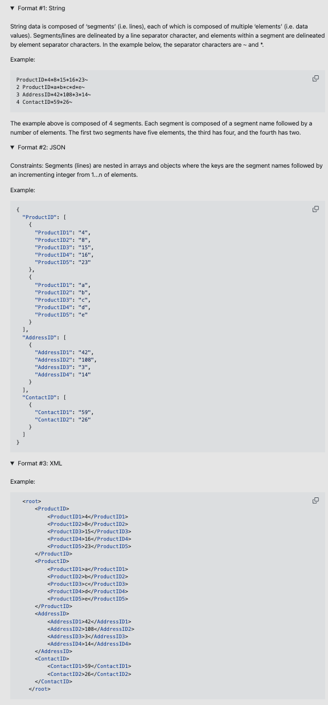

# challenge-document-converter-service

___
=> Project board: https://github.com/users/matheusicaro/projects/6
___

 

- [challenge-document-converter-service](#challenge-document-converter-service)
  - [Intro](#intro)
  - [Challenge](#challenge-🎯)
  - [API Running Screen Shot](#api-running-screen-shot)
  - [Installation and Setup Instructions](#installation-and-setup-instructions)
  - [How it was developed](#how-it-was-developed)
    - [API design and logic](#api-design-and-logic)
    - [API Business logic Definitions](#api-business-logic-definitions)
      - [Entities](#entities)
      - [Providers](#providers)
    - [API Stack - Technologies used](#api-stack---technologies-used)
  - [FUTURE WORK](#future-work)

## Intro

This API which converts documents in 3 formats between them:

- XML to JSON, **_or vice-versa_**
- JSON to STRING, **_or vice-versa_**
- STRING to XML, **_or vice-versa_**

This project was build to reach the following challenge: `Write an API to convert documents between three different formats`

 
 

## Challenge 🎯

Write an API to convert documents between three different formats:

 

 
 
 

## API Running Screen Shot

📸 1. Convert JSON document to XML

 

https://github.com/user-attachments/assets/fee97e33-18b8-4d10-a718-b550e5953fb4

 

📸 2. Convert JSON document to STRING

 

https://github.com/user-attachments/assets/c368cda6-7c7a-460f-bc67-5f047060d7f4

<br.>

📸 3. Convert XML document to JSON

 

https://github.com/user-attachments/assets/9df53b9b-5996-423d-a4c4-62f767fe4a06

 

📸 4. Convert XML document to STRING

 

https://github.com/user-attachments/assets/fb6e0331-9aa9-47de-8465-cf2721aa46ff

 

📸 5. Convert STRING document to JSON

 

https://github.com/user-attachments/assets/f7b4492d-5590-4fbf-9afd-7a4ea56e0b65

 

📸 6. Convert STRING document to XML

 

https://github.com/user-attachments/assets/b9ec63f5-a08b-40fb-a295-00a13576bd50

 

## Installation and Setup Instructions

Clone down this repository. You will need `node` and `npm` installed globally on your machine.

1. clone the repository: `git clone https://github.com/matheusicaro/challenge-document-converter-service.git`
2. Run: `Installation: npm install`
3. Run: `Installation: npm start`
4. Go to `http://[::1]:3000/docs`

📸 

## How it was developed

### API design and logic

The process of convert a document from the type X to Y is designed to run in a pipelined, with a focus on making it scalable for new document conversions.

📸 Steps of converting the document:

 

### API Business logic Definitions

#### Entities

- [entry-file.ts](src/application/domain/entities/entry-file.ts): Entity that defines the info required from the document received to be converted.
- [domain-file.ts](src/application/domain/entities/domain-file.ts): Entity that defines a document known in business logic where is used to be converted to the new format
- [document.ts](src/application/domain/entities/document/document.ts): Entity abstract that defines the base of a document already converted. Each new document format should extends from this document, ex:
  - [json-document.ts](src/application/domain/entities/document/json-document.ts)
  - [string-document.ts](src/application/domain/entities/document/string-document.ts)
  - [xml-document.ts](src/application/domain/entities/document/xml-document.ts)

#### Providers

- [document-pipeline.provider.port.ts](src/application/domain/providers/document-pipeline/document-pipeline.provider.port.ts): The contract of the document pipeline convertor
  - [document-pipeline.provider.adapter.ts](src/application/domain/providers/document-pipeline/document-pipeline.provider.adapter.ts)
- [document-converter.provider.port.ts](src/application/domain/providers/document-converters/document-converter.provider.port.ts): The contract of the document convertor
- [document.ts](src/application/domain/entities/document/document.ts): Entity abstract that defines the base of a document already converted. Each new document format should extends from this document, ex:
  - [json-document-converter.provider.adapter.ts](src/application/domain/providers/document-converters/json-document-converter.provider.adapter.ts): json document converter
  - [xml-document-converter.provider.adapter.ts](src/application/domain/providers/document-converters/xml-document-converter.provider.adapter.ts): xml document converter
  - [string-document-converter.provider.adapter.ts](src/application/domain/providers/document-converters/string-document-converter.provider.adapter.ts): string document converter

### API Stack - Technologies used

The service use a [hexagonal-architecture](https://docs.aws.amazon.com/prescriptive-guidance/latest/cloud-design-patterns/hexagonal-architecture.html) with the definition of Ports and Adapters for the providers.

- Used **[Node.js](https://nodejs.org/en/)** with:
  - **[TypeScript](https://www.typescriptlang.org/)**
  - **[Nest.js framework](https://docs.nestjs.com/)**
  - **[express](https://expressjs.com/)**
- Used **[Jest](https://jestjs.io/)** for unit testing
- Used **[Husky](https://typicode.github.io/husky/#/)** for running defined steps/scripts before make a commit

## FUTURE WORK

Due to my short time available to work on this project, I left some debit techs to be done:

- Increase coverage for unit tets, right the coverage is about `80%`
  - issue created: https://github.com/matheusicaro/challenge-document-converter-service/issues/9

- Add e2e tests
  - issue created: https://github.com/matheusicaro/challenge-document-converter-service/issues/11
